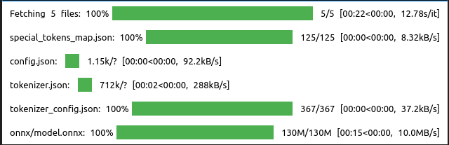
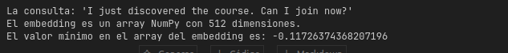
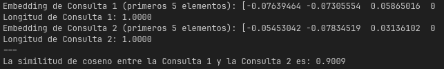
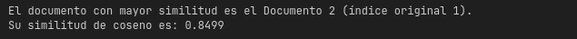
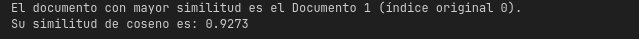
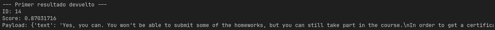

## Homework: Vector Search

## Q1. Embedding the query

Embed the query: `'I just discovered the course. Can I join now?'`.
Use the `'jinaai/jina-embeddings-v2-small-en'` model. 

You should get a numpy array of size 512.

What's the minimal value in this array?

* -0.51
* -0.11
* 0
* 0.51

## Cosine similarity

The vectors that our embedding model returns are already normalized: their length is 1.0.

You can chech that by using the `norm` function:

```python
import numpy as np
np.linalg.norm(q)
```

Which means that we can simply compute the dot product between
two vectors to learn the cosine similarity between them.

For example, if you compute the cosine of the query vector with itself, the result will be 1.0:

```python
q.dot(q)
```

## Answer: -0.11

```python
from fastembed import TextEmbedding
import numpy as np

# Initialize the specific embedding model
embedding_model = TextEmbedding(model_name="jinaai/jina-embeddings-v2-small-en")
```


```python
query = 'I just discovered the course. Can I join now?'
query_embedding = next(embedding_model.embed(query))

query_embedding_array = np.array(query_embedding)
min_value = query_embedding_array.min()

print(f"La consulta: '{query}'")
print(f"El embedding es un array NumPy con {query_embedding_array.shape[0]} dimensiones.")
print(f"El valor mínimo en el array del embedding es: {min_value}")
```



## Q2. Cosine similarity with another vector

Now let's embed this document:

```python
doc = 'Can I still join the course after the start date?'
```

What's the cosine similarity between the vector for the query
and the vector for the document?

* 0.3
* 0.5
* 0.7
* 0.9

## ANswer: 

```python
# Paso 1: Inicializar el modelo de embedding
embedding_model = TextEmbedding(model_name="jinaai/jina-embeddings-v2-small-en")

# Paso 2: Generar el embedding para la Consulta 1
query1 = 'I just discovered the course. Can I join now?'
q1_embedding = next(embedding_model.embed(query1))

# Paso 3: Generar el embedding para la Consulta 2
query2 = 'Can I still join the course after the start date?'
q2_embedding = next(embedding_model.embed(query2))

# Paso 4: Calcular la similitud de coseno usando el producto punto
# Asumimos que los embeddings están normalizados (longitud 1.0)
cosine_similarity = q1_embedding.dot(q2_embedding)

print(f"Embedding de Consulta 1 (primeros 5 elementos): {q1_embedding[:5]}")
print(f"Longitud de Consulta 1: {np.linalg.norm(q1_embedding):.4f}")
print(f"Embedding de Consulta 2 (primeros 5 elementos): {q2_embedding[:5]}")
print(f"Longitud de Consulta 2: {np.linalg.norm(q2_embedding):.4f}")
print(f"---")
print(f"La similitud de coseno entre la Consulta 1 y la Consulta 2 es: {cosine_similarity:.4f}")

```


## Q3. Ranking by cosine

For Q3 and Q4 we will use these documents:

```python
documents = [{'text': "Yes, even if you don't register, you're still eligible to submit the homeworks.\nBe aware, however, that there will be deadlines for turning in the final projects. So don't leave everything for the last minute.",
  'section': 'General course-related questions',
  'question': 'Course - Can I still join the course after the start date?',
  'course': 'data-engineering-zoomcamp'},
 {'text': 'Yes, we will keep all the materials after the course finishes, so you can follow the course at your own pace after it finishes.\nYou can also continue looking at the homeworks and continue preparing for the next cohort. I guess you can also start working on your final capstone project.',
  'section': 'General course-related questions',
  'question': 'Course - Can I follow the course after it finishes?',
  'course': 'data-engineering-zoomcamp'},
 {'text': "The purpose of this document is to capture frequently asked technical questions\nThe exact day and hour of the course will be 15th Jan 2024 at 17h00. The course will start with the first  “Office Hours'' live.1\nSubscribe to course public Google Calendar (it works from Desktop only).\nRegister before the course starts using this link.\nJoin the course Telegram channel with announcements.\nDon’t forget to register in DataTalks.Club's Slack and join the channel.",
  'section': 'General course-related questions',
  'question': 'Course - When will the course start?',
  'course': 'data-engineering-zoomcamp'},
 {'text': 'You can start by installing and setting up all the dependencies and requirements:\nGoogle cloud account\nGoogle Cloud SDK\nPython 3 (installed with Anaconda)\nTerraform\nGit\nLook over the prerequisites and syllabus to see if you are comfortable with these subjects.',
  'section': 'General course-related questions',
  'question': 'Course - What can I do before the course starts?',
  'course': 'data-engineering-zoomcamp'},
 {'text': 'Star the repo! Share it with friends if you find it useful ❣️\nCreate a PR if you see you can improve the text or the structure of the repository.',
  'section': 'General course-related questions',
  'question': 'How can we contribute to the course?',
  'course': 'data-engineering-zoomcamp'}]
```

Compute the embeddings for the text field, and compute the 
cosine between the query vector and all the documents.

What's the document index with the highest similarity? (Indexing starts from 0):

- 0
- 1
- 2
- 3
- 4

Hint: if you put all the embeddings of the text field in one matrix `V` (a single 2-dimensional numpy array), then
computing the cosine becomes a matrix multiplication:

```python
V.dot(q)
```

If this hint is rather confusing you than helping, feel free
to ignore it.

## Answer: 1

```python
import numpy as np
from fastembed import TextEmbedding

# --- 1. Datos de entrada ---
documents = [
    {'text': "Yes, even if you don't register, you're still eligible to submit the homeworks.\nBe aware, however, that there will be deadlines for turning in the final projects. So don't leave everything for the last minute.",
     'section': 'General course-related questions',
     'question': 'Course - Can I still join the course after the start date?',
     'course': 'data-engineering-zoomcamp'},
    {'text': 'Yes, we will keep all the materials after the course finishes, so you can follow the course at your own pace after it finishes.\nYou can also continue looking at the homeworks and continue preparing for the next cohort. I guess you can also start working on your final capstone project.',
     'section': 'General course-related questions',
     'question': 'Course - Can I follow the course after it finishes?',
     'course': 'data-engineering-zoomcamp'},
    {'text': "The purpose of this document is to capture frequently asked technical questions\nThe exact day and hour of the course will be 15th Jan 2024 at 17h00. The course will start with the first  “Office Hours'' live.1\nSubscribe to course public Google Calendar (it works from Desktop only).\nRegister before the course starts using this link.\nJoin the course Telegram channel with announcements.\nDon’t forget to register in DataTalks.Club's Slack and join the channel.",
     'section': 'General course-related questions',
     'question': 'Course - When will the course start?',
     'course': 'data-engineering-zoomcamp'},
    {'text': 'You can start by installing and setting up all the dependencies and requirements:\nGoogle cloud account\nGoogle Cloud SDK\nPython 3 (installed with Anaconda)\nTerraform\nGit\nLook over the prerequisites and syllabus to see if you are comfortable with these subjects.',
     'section': 'General course-related questions',
     'question': 'Course - What can I do before the course starts?',
     'course': 'data-engineering-zoomcamp'},
    {'text': 'Star the repo! Share it with friends if you find it useful ❣️\nCreate a PR if you see you can improve the text or the structure of the repository.',
     'section': 'General course-related questions',
     'question': 'How can we contribute to the course?',
     'course': 'data-engineering-zoomcamp'}
]

query = 'Can I still join the course after the start date?'

# --- 2. Inicializar el modelo de embedding ---
print("Inicializando el modelo de embedding...")
embedding_model = TextEmbedding(model_name="jinaai/jina-embeddings-v2-small-en")

# --- 3. Generar el embedding de la consulta ---
print(f"Generando embedding para la consulta: '{query}'")
query_embedding = next(embedding_model.embed(query))

# --- 4. Generar embeddings para cada documento ---
print("Generando embeddings para los documentos...")
document_texts = [doc['text'] for doc in documents]
# El método embed puede tomar una lista de textos y devolverá un generador
document_embeddings = list(embedding_model.embed(document_texts))

# --- 5. Calcular la similitud de coseno para cada documento ---
print("\nCalculando similitud de coseno entre la consulta y cada documento:")
results = []
for i, doc_embedding in enumerate(document_embeddings):
    # Ya que los embeddings de jinaai/jina-embeddings-v2-small-en están normalizados,
    # el producto punto es directamente la similitud de coseno.
    cosine_similarity = query_embedding.dot(doc_embedding)
    results.append({
        'document_index': i,
        'text': documents[i]['text'][:100] + '...', # Mostrar solo un fragmento del texto
        'similitud_coseno': cosine_similarity
    })
    print(f"Documento {i+1}:")
    print(f"  Texto (fragmento): {documents[i]['text'][:100]}...")
    print(f"  Similitud de Coseno: {cosine_similarity:.4f}\n")

# Opcional: Ordenar los resultados por similitud para ver los más relevantes primero
results_sorted = sorted(results, key=lambda x: x['similitud_coseno'], reverse=True)

print("--- Resultados ordenados por similitud de coseno ---")
for res in results_sorted:
    print(f"Documento {res['document_index']+1} (Similitud: {res['similitud_coseno']:.4f}):")
    print(f"  Texto: {res['text']}\n")

if results_sorted:
    documento_mas_similar = results_sorted[0]
    indice_original = documento_mas_similar['document_index']
    similitud = documento_mas_similar['similitud_coseno']
    print(f"El documento con mayor similitud es el Documento {indice_original + 1} (índice original {indice_original}).")
    print(f"Su similitud de coseno es: {similitud:.4f}")
else:
    print("No se encontraron resultados.")    
```


## Q4. Ranking by cosine, version two

Now let's calculate a new field, which is a concatenation of
`question` and `text`:

```python
full_text = doc['question'] + ' ' + doc['text']
``` 

Embed this field and compute the cosine between it and the
query vector. What's the highest scoring document?

- 0
- 1
- 2
- 3
- 4

Is it different from Q3? If yes, why?

## Answer: 0
```python
import numpy as np
from fastembed import TextEmbedding

# --- 1. Datos de entrada ---
documents = [
    {'text': "Yes, even if you don't register, you're still eligible to submit the homeworks.\nBe aware, however, that there will be deadlines for turning in the final projects. So don't leave everything for the last minute.",
     'section': 'General course-related questions',
     'question': 'Course - Can I still join the course after the start date?',
     'course': 'data-engineering-zoomcamp'},
    {'text': 'Yes, we will keep all the materials after the course finishes, so you can follow the course at your own pace after it finishes.\nYou can also continue looking at the homeworks and continue preparing for the next cohort. I guess you can also start working on your final capstone project.',
     'section': 'General course-related questions',
     'question': 'Course - Can I follow the course after it finishes?',
     'course': 'data-engineering-zoomcamp'},
    {'text': "The purpose of this document is to capture frequently asked technical questions\nThe exact day and hour of the course will be 15th Jan 2024 at 17h00. The course will start with the first  “Office Hours'' live.1\nSubscribe to course public Google Calendar (it works from Desktop only).\nRegister before the course starts using this link.\nJoin the course Telegram channel with announcements.\nDon’t forget to register in DataTalks.Club's Slack and join the channel.",
     'section': 'General course-related questions',
     'question': 'Course - When will the course start?',
     'course': 'data-engineering-zoomcamp'},
    {'text': 'You can start by installing and setting up all the dependencies and requirements:\nGoogle cloud account\nGoogle Cloud SDK\nPython 3 (installed with Anaconda)\nTerraform\nGit\nLook over the prerequisites and syllabus to see if you are comfortable with these subjects.',
     'section': 'General course-related questions',
     'question': 'Course - What can I do before the course starts?',
     'course': 'data-engineering-zoomcamp'},
    {'text': 'Star the repo! Share it with friends if you find it useful ❣️\nCreate a PR if you see you can improve the text or the structure of the repository.',
     'section': 'General course-related questions',
     'question': 'How can we contribute to the course?',
     'course': 'data-engineering-zoomcamp'}
]

query = 'Can I still join the course after the start date?'

# --- 2. Inicializar el modelo de embedding ---
print("Inicializando el modelo de embedding...")
embedding_model = TextEmbedding(model_name="jinaai/jina-embeddings-v2-small-en")

# --- 3. Generar el embedding de la consulta ---
print(f"Generando embedding para la consulta: '{query}'")
query_embedding = next(embedding_model.embed(query))

# --- 4. Generar embeddings para cada documento ---
print("Generando embeddings para los documentos...")
document_texts = [doc['question'] + ' ' + doc['text'] for doc in documents]
# El método embed puede tomar una lista de textos y devolverá un generador
document_embeddings = list(embedding_model.embed(document_texts))

# --- 5. Calcular la similitud de coseno para cada documento ---
print("\nCalculando similitud de coseno entre la consulta y cada documento:")
results = []
for i, doc_embedding in enumerate(document_embeddings):
    # Ya que los embeddings de jinaai/jina-embeddings-v2-small-en están normalizados,
    # el producto punto es directamente la similitud de coseno.
    cosine_similarity = query_embedding.dot(doc_embedding)
    results.append({
        'document_index': i,
        'text': documents[i]['text'][:100] + '...', # Mostrar solo un fragmento del texto
        'similitud_coseno': cosine_similarity
    })
    print(f"Documento {i+1}:")
    print(f"  Texto (fragmento): {documents[i]['text'][:100]}...")
    print(f"  Similitud de Coseno: {cosine_similarity:.4f}\n")

# Opcional: Ordenar los resultados por similitud para ver los más relevantes primero
results_sorted = sorted(results, key=lambda x: x['similitud_coseno'], reverse=True)

print("--- Resultados ordenados por similitud de coseno ---")
for res in results_sorted:
    print(f"Documento {res['document_index']+1} (Similitud: {res['similitud_coseno']:.4f}):")
    print(f"  Texto: {res['text']}\n")
```


Is it different from Q3? If yes, why?

Yes because Since embeddings represent the meaning of the text, longer, more descriptive text may result in a different vector representation. The distances (similarities) between the query embedding and the documents' embeddings also change. Documents that were previously irrelevant may rise in ranking, or vice versa.

## Q5. Selecting the embedding model

Now let's select a smaller embedding model.
What's the smallest dimensionality for models in fastembed?

- 128
- 256
- 384
- 512

One of these models is `BAAI/bge-small-en`. Let's use it.

## Answer: 384

## Q6. Indexing with qdrant (2 points)

For the last question, we will use more documents.

We will select only FAQ records from our ml zoomcamp:

```python
import requests 

docs_url = 'https://github.com/alexeygrigorev/llm-rag-workshop/raw/main/notebooks/documents.json'
docs_response = requests.get(docs_url)
documents_raw = docs_response.json()


documents = []

for course in documents_raw:
    course_name = course['course']
    if course_name != 'machine-learning-zoomcamp':
        continue

    for doc in course['documents']:
        doc['course'] = course_name
        documents.append(doc)
```

Add them to qdrant using the model form Q5.

When adding the data, use both question and answer fields:

```python
text = doc['question'] + ' ' + doc['text']
```

After the data is inserted, use the question from Q1 for querying the collection.

What's the highest score in the results?
(The score for the first returned record):

- 0.97
- 0.87
- 0.77
- 0.67


## Answer: 0.87

```python

from fastembed import TextEmbedding
import numpy as np
from qdrant_client import QdrantClient
from qdrant_client.http.models import Distance, VectorParams

# --- 1. Datos  ---


query = "I just discovered the course. Can I join now?"

# --- 2. Inicializar modelo de embedding ---
model = TextEmbedding(model_name="BAAI/bge-small-en")

# --- 3. Preparar texto para embedding ---
texts = [doc['question'] + ' ' + doc['text'] for doc in documents]

# --- 4. Generar embeddings ---
print("Generando embeddings...")
embeddings = list(model.embed(texts))
query_embedding = next(model.embed(query))

# Convertir a listas normales (list) desde tipos internos de fastembed
embeddings_list = [emb.tolist() for emb in embeddings]
query_vector = query_embedding.tolist()

# --- 5. Conectar con Qdrant ---
client = QdrantClient(url="http://localhost:6333")

collection_name = "course_qa"

# Crear colección (si no existe)
if not client.collection_exists(collection_name):
    print(f"Creando colección '{collection_name}'...")
    client.create_collection(
        collection_name=collection_name,
        vectors_config=VectorParams(size=len(embeddings_list[0]), distance=Distance.COSINE)
    )

# Subir vectores a Qdrant
print("Indexando documentos...")
client.upsert(
    collection_name=collection_name,
    points=[
        {
            "id": idx,
            "vector": embedding,
            "payload": {
                "text": doc["text"],
                "question": doc["question"],
                "course": doc["course"]
            }
        }
        for idx, (embedding, doc) in enumerate(zip(embeddings_list, documents))
    ]
)

# --- 6. Buscar en Qdrant ---
print("\nBuscando resultados...")
search_result = client.search(
    collection_name=collection_name,
    query_vector=query_vector,
    limit=1  # Solo queremos el primer resultado
)

# --- 7. Mostrar el primer resultado y su score ---
first_result = search_result[0]
print("\n--- Primer resultado devuelto ---")
print("ID:", first_result.id)
print("Score:", first_result.score)
print("Payload:", first_result.payload)
```
